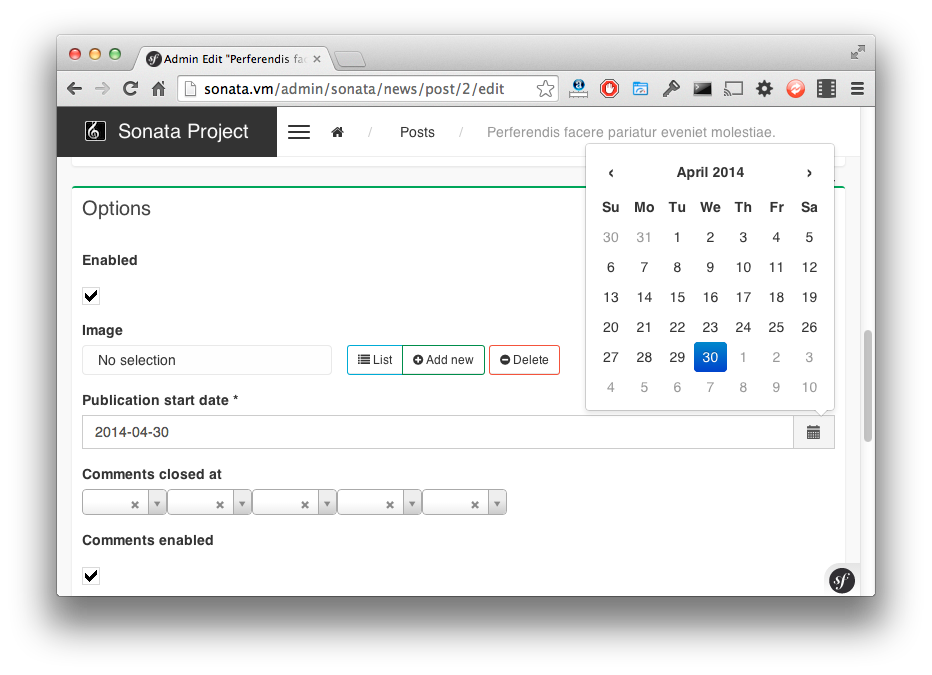

.. index::
    double: Form Type; Definition

Form Types
==========

The bundle comes with some handy form types.

ImmutableArrayType
------------------

The ``Immutable Array`` allows you to edit an array property by defining a type per key.

The type has a ``keys`` parameter which contains the definition for each key.
A definition is either a ``FormBuilder`` instance or an array with 3 options:

* key name,
* type: a type name or a ``FormType`` instance,
* related type parameters: please refer to the related form documentation.

Let's say a ``Page`` has options property with some fixed key-value pairs.
Each value has a different type: `integer`, `url`, or `string` for instance::

    // src/Entity/Page.php

    class Page
    {
        protected $options = [
            'ttl' => 1,
            'redirect' => '',
        [;

        public function setOptions(array $options): void
        {
            $this->options = $options;
        }

        public function getOptions(): array
        {
            return $this->options;
        }
    }

Now, the property can be edited by setting a type for each type::

    // src/Admin/PageAdmin.php

    use Sonata\Form\Type\ImmutableArrayType;

    final class PageAdmin extends AbstractAdmin
    {
        protected function configureFormFields(FormMapper $form): void
        {
            $form
                ->add('options', ImmutableArrayType::class, [
                    'keys' => [
                        ['ttl', 'text', ['required' => false]],
                        ['redirect', 'url', ['required' => true]],
                    ]
                ]);
        }
    }

BooleanType
-----------

The ``boolean`` type is a specialized ``ChoiceType``, where the list of choices is locked to *yes* and *no*.

Note that for backward compatibility reasons, it will set your value to *1* for *yes* and to *2* for *no*.
If you want to map to a boolean value, just set the option ``transform`` to true. For instance, you need to do so when mapping to a doctrine boolean.

TranslatableChoiceType
----------------------

The translatable type is a specialized ``ChoiceType`` where the choices values are
translated with the Symfony Translator component. The type has one extra parameter ``catalogue`` (the catalogue name to translate the value)::

    // src/Admin/DeliveryAdmin.php

    use Sonata\Form\Type\TranslatableChoiceType;

    final class DeliveryAdmin extends AbstractAdmin
    {
        protected function configureFormFields(FormMapper $form): void
        {
            $form
                ->add('deliveryStatus', TranslatableChoiceType::class, [
                    'choices' => Delivery::getStatusList(),
                    'catalogue' => 'SonataOrderBundle'
                ]);
        }
    }

.. code-block:: php

    // src/Entity/Delivery.php

    class Delivery
    {
        public static function getStatusList(): array
        {
            return [
                self::STATUS_OPEN      => 'status_open',
                self::STATUS_PENDING   => 'status_pending',
                self::STATUS_VALIDATED => 'status_validated',
                self::STATUS_CANCELLED => 'status_cancelled',
                self::STATUS_ERROR     => 'status_error',
                self::STATUS_STOPPED   => 'status_stopped',
            ];
        }
    }

.. note::

    For more information, you can check the official `ChoiceType documentation`_ .

CollectionType
--------------

The ``Collection Type`` is meant to handle creation and editing of model
collections. Rows can be added and deleted, and your model abstraction layer may
allow you to edit fields inline. You can use ``type_options`` to pass values
to the underlying forms::

    // src/Entity/ProductAdmin.php

    use Sonata\Form\Type\CollectionType;

    final class ProductAdmin extends AbstractAdmin
    {
        protected function configureFormFields(FormMapper $form): void
        {
            $form
                ->add('sales', CollectionType::class, [

                    // Prevents the "Delete" option from being displayed
                    'type_options' => ['delete' => false]
                ], [
                    'edit' => 'inline',
                    'inline' => 'table',
                    'sortable' => 'position',
                ]);
        }
    }

The available options (which can be passed as a third parameter to ``FormMapper::add()``) are:

btn_add and btn_catalogue:
  The label on the ``add`` button can be customized
  with this parameters. Setting it to ``false`` will hide the
  corresponding button. You can also specify a custom translation catalogue
  for this label, which defaults to ``SonataAdminBundle``.

type_options:
  This array is passed to the underlying forms.

pre_bind_data_callback:
  This closure will be executed during the preBind method (``FormEvent::PRE_BIND`` | ``FormEvent::PRE_SUBMIT``)
  to build the data given to the form based on the value retrieved. Use this if you need to generate your forms based
  on the submitted data.

.. tip::

    A jQuery event is fired after a row has been added (``sonata-admin-append-form-element``).
    You can listen to this event to trigger custom javascript (eg: add a calendar widget to a
    newly added date field)

StatusType
----------

The ``StatusType`` is not available as a service. However, you can use it to declare
your own type to render a choice of status.

Let's say, you have a ``Delivery::getStatusList`` method which returns a list of status.
Now, you want to create a form type to expose those values::

    // src/Entity/Delivery.php

    class Delivery
    {
        public static function getStatusList(): array
        {
            return [
                self::STATUS_OPEN      => 'status_open',
                self::STATUS_PENDING   => 'status_pending',
                self::STATUS_VALIDATED => 'status_validated',
                self::STATUS_CANCELLED => 'status_cancelled',
                self::STATUS_ERROR     => 'status_error',
                self::STATUS_STOPPED   => 'status_stopped',
            ];
        }
    }

This can be done by declaring a new service:

.. code-block:: xml

    <service id="sonata.order.form.status_type" class="Sonata\Form\Type\StatusType">
        <tag name="form.type"/>

        <argument>%sonata.order.order.class%</argument>
        <argument>getStatusList</argument>
        <argument>sonata_order_status</argument>
    </service>

And the type can now be used::

    // src/Admin/DeliveryAdmin.php

    use App\Type\OrderStatusType;

    final class DeliveryAdmin extends AbstractAdmin
    {
        protected function configureFormFields(FormMapper $form): void
        {
            $form
                ->add('deliveryStatus', OrderStatusType::class)
                // ...
            ;
        }
    }

.. warning::

    ``StatusType`` cannot be used directly with Symfony3.0, you need to
    extend the class ``BaseStatusType`` with an empty class to have a
    unique FQCN.

DatePickerType / DateTimePickerType
-----------------------------------

Those types integrate `Eonasdan's Tempus Dominus`_ into a
Symfony form. They both are available as services and inherit from
``date`` and ``datetime`` default form types.

They will allow you to have a JS date picker onto your form fields as follows:

In your form, you may use the form type as follows::

    // src/Admin/PageAdmin.php

    use Sonata\Form\Type\DatePickerType;
    use Sonata\Form\Type\DateTimePickerType;

    final class PageAdmin extends AbstractAdmin
    {
        protected function configureFormFields(FormMapper $form): void
        {
            $form
                ->add('publicationDateStart', DateTimePickerType::class)

                // or DatePickerType if you don't need the time
                ->add('publicationDateStart', DatePickerType::class);
        }
    }

Almost all the `standard date picker options`_ are available by adding options with in the ``datepicker_options`` array::

    // src/Admin/PageAdmin.php

    use Sonata\Form\Type\DatePickerType;
    use Sonata\Form\Type\DateTimePickerType;

    final class PageAdmin extends AbstractAdmin
    {
        protected function configureFormFields(FormMapper $form): void
        {
            $form
                ->add('publicationDateStart', DateTimePickerType::class, [
                    'datepicker_options' => [
                        'useCurrent' => false,
                        'display' => [
                            'sideBySide' => true,
                            'calendarWeeks' => false,
                            'viewMode' => 'days',
                            'components' => [
                                'seconds' => false,
                            ],
                        ],
                    ],
                ])

                // or DatePickerType if you don't need the time
                ->add('publicationDateStart', DatePickerType::class, [
                    'datepicker_options' => [
                        'useCurrent' => false,
                    ],
                ]);
        }
    }

If you look in the ``BasePickerType.php`` you can see all the currently available options.

In addition to these standard options, there is also the option ``datepicker_use_button``
which, when used, will change the widget so that the datepicker icon is not shown and the
pop-up datepicker is invoked simply by clicking on the date input.

If you are not using ``SonataAdminBundle`` (or you want to use the date picker in a non-Admin context),
you should register the controller on the Stimulus application::

.. code-block:: js

    // assets/js/app.js

    import { Application } from 'stimulus';

    import DatePicker from './../../vendor/sonata-project/form-extensions/assets/js/datepicker_controller.js';

    const application = Application.start();
    application.register('datepicker', DatePicker);

DateRangePickerType and DateTimeRangePickerType
-----------------------------------------------

Those types extend the basic range form field types
(``Sonata\Form\Type\DateRangeType`` and
``Sonata\Form\Type\DateTimeRangeType``).

You can use them if you need datetime picker in datetime range filters.

Example with ``Sonata\DoctrineORMAdminBundle\Filter\DateRangeFilter`` filter::

    // src/Admin/PostAdmin.php

    use Sonata\Form\Type\DateRangeType;
    use Sonata\DoctrineORMAdminBundle\Filter\DateRangeFilter;

    final class PostAdmin extends AbstractAdmin
    {
        protected function configureDatagridFilters(DatagridMapper $datagrid): void
        {
            $datagrid
                ->add('createdAt', DateRangeFilter::class, [
                    'field_type' => DateRangeType::class,
                ]);
        }
    }

.. _`ChoiceType documentation`: https://symfony.com/doc/current/reference/forms/types/choice.html
.. _`Eonasdan's Tempus Dominus`: https://github.com/Eonasdan/tempus-dominus
.. _`standard date picker options`: https://getdatepicker.com/6/options/
